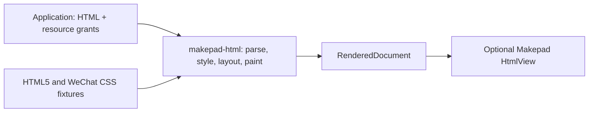

# makepad-html boundaries

makepad-html is a standalone library and test project. It accepts HTML/CSS and
host-approved resource snapshots and produces native render output.

- **Core (`src/lib.rs`)**: renderer options, bounded resource snapshots,
  admission checks, rendering, diagnostics and pixel conversion. The public
  types are `RenderedDocument`, `RenderOptions`, `ResourceMap`, `ResourceReport`
  and `RenderError`; the entry point is `render_html`.
- **Makepad (`src/makepad.rs`)**: `HtmlView` registration, texture upload,
  scrolling and clearing. Hosts schedule rendering and discard stale results.
- **Engine (`vendor/blitz`)**: pinned source, provenance and reviewable fixes.
  Generic CSS regressions live in `tests/css_regressions.rs`.
- **Examples**: `viewer` is a native standalone app. It reads only files supplied
  on its command line and grants resources explicitly. `render_fixture` and
  `compare_html` supply headless rendering and raw-engine diagnostic capture.
- **Lab**: general HTML5 and WeChat-derived fixtures, WKWebView capture tools,
  independent reproduction scripts and historical evidence. The WeChat suite
  is a compatibility profile, not the component's domain model.

The consuming app owns editable document schemas, Markdown conversion, themes,
asset selection/downloads, account/session authority, storage, consent,
publishing/withdrawal, Matrix messages and Octoscript bindings. None of those
are dependencies or responsibilities of this component.

The widget displays a bitmap. `DocumentSession` optionally keeps the source DOM
and immutable resource grants on a worker. Document-coordinate taps and horizontal
scroll events produce link requests, fragment scroll requests, disclosure toggles
and nested horizontal scrolling; the host handles navigation and session lifetime.
The standalone viewer wires these APIs together. Selection/copy, keyboard focus,
accessibility, lossless HTML/CSS editing, vertical nested gesture routing and
animation remain future work. The admission/resource policy is unchanged.

The public production renderer rejects SVG and active/subdocument elements.
`test-svg` only enables the raw-engine regression path; it does not grant SVG
admission to `render_html`. Input/output budgets do not provide a CPU sandbox.
